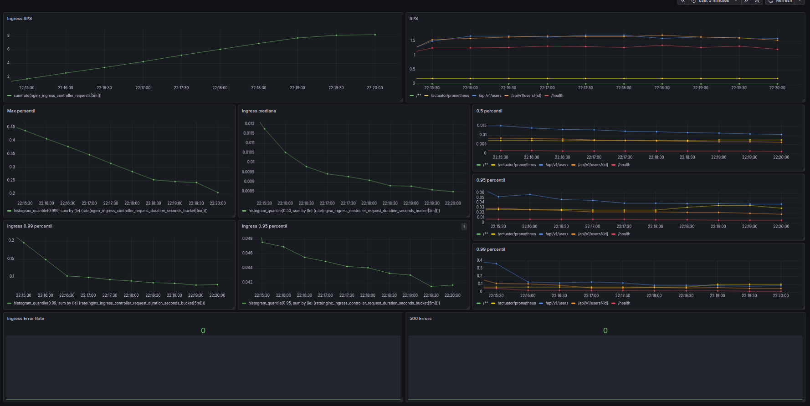

# 2025-10-otus-microservices-Didenko
Репозиторий для курса по микросервисной архитектуре

## HW2

#### Работа с Docker Hub
`docker build -t danilflint/ok_microservice:latest .`
`docker push danilflint/ok_microservice:latest`

#### Запуск приложения
`cd Microservice`  
`docker-compose up -d`

## HW3
#### Полезные команды
`minikube start --nodes 2` - запуск minikube  
`minikube node add` - добавление ноды
`minikube addons list` - список плагинов
`minikube addons enable ingress` - активировать ingress
`snap install kubectl --classic` - установка kubectl  
https://krew.sigs.k8s.io/docs/user-guide/setup/install/ - установка krew (менеджер плагинов)  
`kubectl krew install node-shell` - установка средства подключения к нодам

`kubectl get pod` - посмотреть поды  
`kubectl get node` - посмотреть ноды  
`kubectl get deployment` - посмотреть deployments  
`kubectl get service` - посмотреть сервисы  
`kubectl get ingress` - посмотреть ingresses  
`kubectl apply -f *.yaml` - применение конфигурации  
`kubectl delete pod <имя>` - удаление пода  
`kubectl delete deployment <имя>` - удаление deployment
`kubectl delete service <имя>` - удаление сервиса  
`kubectl delete ingress <имя>` - удаление ingress  
`kubectl get pod -o wide` - расширенная информация о поде  
`kubectl proxy` - позволяет на localhost обращаться к подам
`kubectl describe pod ok-app` - описание состояния пода
`kubectl node-shell <node>`
`kubectl exec -it <имя_пода> -- /bin/{bash | sh}` - подключиться к поду

#### Запуск кластера
1. `cd Microservice`
2. `minikube start --nodes 2`
3. `minikube addons enable ingress`
4. `kubectl apply -f kubernetes/.`
4. `curl http://arch.homework/health` (прописать у себя в /etc/hosts хост arch.homework)

## HW4  
#### Запуск кластера  
1. `cd Microservice`
2. `minikube start --nodes 2`
3. `minikube addons enable ingress`
4. `kubectl create configmap ok-app-sql-migrations --from-file=./src/main/resources/db/migration/V1__init.sql`
5. `helm install db oci://registry-1.docker.io/bitnamicharts/postgresql -f ./kubernetes/values.yaml`
6. `kubectl apply -f ./kubernetes/job-migration.yaml`
4. `kubectl apply -f kubernetes/.`
4. `curl http://arch.homework/health` (прописать у себя в /etc/hosts хост arch.homework)

## HW5
#### Полезные команды
`minikube dashboard` - запускает дашборд
`kubectl get svc -A` - проверка портов, которые слушают сервисы
`kubectl get secret stack-grafana -o jsonpath="{.data.admin-password}" | base64 --decode ; echo` - узнать пароль от Grafana
`kubectl rollout restart deployment ok-app-dp` - перезапуск

`nginx_ingress_controller_request_duration_seconds_count` - посмотреть, доходят ли метрики

#### Запуск кластера 
1. `cd Microservice`
2. `minikube start --nodes 2`
3. `minikube addons enable ingress`
4. `kubectl patch deployment ingress-nginx-controller -n ingress-nginx --type='json' -p='[{"op": "add", "path": "/spec/template/spec/containers/0/args/-", "value": "--enable-metrics"}]'` - добавить строку "- --enable-metrics" в секцию "args"
5. `kubectl patch svc ingress-nginx-controller -n ingress-nginx --type='json' -p='[{"op": "add", "path": "/spec/ports/-", "value": {"name": "metrics", "port": 10254, "targetPort": 10254, "protocol": "TCP"}}]'`
4. `kubectl create namespace monitoring`
4. `kubectl create configmap ok-app-sql-migrations --from-file=./src/main/resources/db/migration/V1__init.sql`
5. `helm install db oci://registry-1.docker.io/bitnamicharts/postgresql -f ./kubernetes/values.yaml`
6. `kubectl apply -f ./kubernetes/job-migration.yaml`
7. `helm repo add prometheus-community https://prometheus-community.github.io/helm-charts`
8. `helm repo update`
9. `helm install stack prometheus-community/kube-prometheus-stack -f ./kubernetes/prometheus.yaml`
10. `kubectl apply -f kubernetes/.`
11. `kubectl port-forward service/prometheus-operated 9090`
12. `kubectl port-forward service/stack-grafana 9000:80`
13. `curl http://arch.homework/health` (прописать у себя в /etc/hosts хост arch.homework)

#### Результат стресс-тестирования

